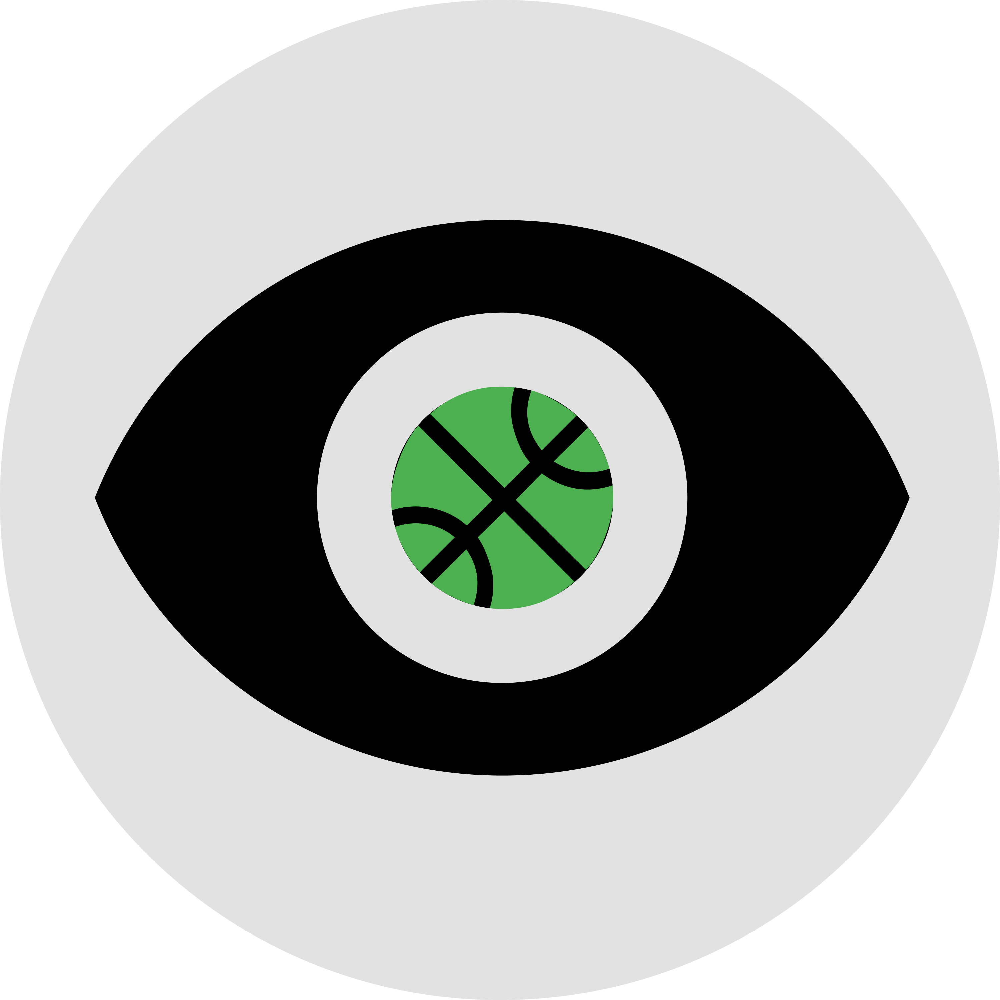

<h1>EyeBall: Basketball Path Tracking</h1>

CS 585 (Image and Video Computing) final project.   
Team: Sameer Chaturvedi, Andrew Spencer  
Project Presentation Slides: https://docs.google.com/presentation/d/1iuBok714z94xEYZOMJdP4Htobj-RjBGhJ0lYmK0Ev3s/edit?usp=sharing   

<h2> Motivation </h2>

In basketball, the game revolves around moving the ball to reach its goal. “Plays” are run on the court to achieve this, and are typically analyzed by player movement and outdated positions. However, plays are drawn up with a focus on the ball itself! There exists no technology so far that analyzes video of a play and produces results - but there’s a massive amount of data - over 200 possessions per game! Computer vision can help us reach conclusions based on the path of a ball given a possession. In this project we are going to focus specifically on the number of passes made in a certain play/game.

<h2> Goal </h2>

We are trying to solve this problem by using computer vision techniques learned in class to track the path of a ball in a given play, and produce useful insights about it - such as the number of passes.
  

<h2> Dataset </h2>

Live broadcast games of basketball proved to be tricky to work with, since they involve unnecessary (for our purpose) zooming in on players, the ball, etc., and awkward camera angles. As a result, it would be difficult to make much sense of the path of the basketball with the view changing so often. 
To account for this, we used a simulation for our own synthetic data. The video game, NBA 2k20, provides a realistic and accurate depiction of basketball plays, and we can grab videos in the desired camera angle. As a result, we chose NBA 2k20 videos as our dataset.  

<h2> Methods </h2>

<h3> Detecting the ball </h3>

 Initially, we tried implementing template matching and motion energy templates to detect the ball in the video. This did not provide very accurate results, since it relied on a specific template of the basketball that varied from both frame to frame (due to, say, occlusions from the player’s hand) and video to video. Since it wasn’t a scalable solution, we moved on.  
We also tried implementing Hough Circles detection to find the ball, but this also proved to be inaccurate, since it couldn’t detect the ball even when it was covered by the player’s hand, and it often detected non-circles (such as the player’s shoulder) as the ball.  
We had to make improvements, so we implemented our own custom ball detection algorithm using traditional computer vision methods we learned in class.  
First, we process the video frame by frame and apply a Gaussian blur for preprocessing to smooth out the features. Then, we filter the frame by a HSV color range, which would capture the ball and similar regions of color. The resultant filtered image is converted to binary, so all that is seen is the HSV filtered objects. We then perform the erosion and dilation morphological operations on this to remove small blobs.  
Then, we find all the contours in this image, and iterate over them to filter the selection by shape. Specifically, we are looking for near-circles, to account for occlusions of the ball by hand, within a certain threshold. Only detected contours that fulfill this near-circle threshold move on. Then, we filter by area of the contour, since we know the predicted area of the basketball due to a relatively constant height and zoom of the video dataset.  
Finally, from the resultant filtered frame, we calculate the circularity using moments for all the detected contours, and the most circular one, is detected as the ball with the highest probability. This algorithm already detects the ball with a high accuracy, provided it is at least visible in the frame. The next section on tracking accounts for this. 

<h3>Tracking the ball</h3>

Sometimes, the ball is completely occluded by the players, so the detection algorithm will not find it. In some cases, the ball may be slightly visible, but the algorithm finds other objects that look like the ball. These cases completely ruin the following of the ball path, since it leads to the tracked path jumping around from detected object to object. To solve this, we decided to implement a Kalman Filter.  
The Kalman Filter uses prior positions of the ball to predict the next position. It has a distance threshold so that detections far away from the ball are not counted as the ball itself (minimizes glitches where the ball jumps across the screen), and has a threshold for frames where the ball is not detected before it detects it as a new object (this helps with occlusion).  
We use these predicted values as the detected position of the ball to draw the trace of the path, and this results in very accurate tracking.  

<h2>Generating Insights</h2>

Pass detection was done with a custom algorithm designed by us. We first stored the points where the ball was tracked in previous frames into a queue. Then we used the 3 most recent points. Each frame, we calculated the angle between the two vectors that were formed by these last 3 points that the ball was detected at. If the angle was between 0-60 degrees or 300-360 degrees and enough frames had passed since the last pass was detected (30 frames), we labelled this as a possible pass. Then we used the queue of points to find the average vertical and horizontal movement over the past 10 frames of the video. If the vertical movement was under 120 pixels, then we label this as a pass and update the pass count. This seemed to work fairly well for our dataset, although the frames passed threshold and vertical movement threshold may have to be adjusted for different videos.

<h2> Results</h2>

Video 1: This video displays the results for tracking the ball in the video of the play.  
https://drive.google.com/file/d/1puyo55EnbmYyeKux5GK-Odz8ft_kC_S1/view?usp=sharing
  
Video 2: This video displays the results for detecting the number of passes in a play.  
https://drive.google.com/file/d/17IWkNZLDxjkMbnsnP1lTesk4JWSOy3d5/view?usp=sharing
  
(Confusion Matrix)
|Confusion Matrix|                |                | \n
| :------------- | :------------- | :------------- | \n
|                | TP = 10        | FP = 3         | \n
| :------------- | :------------- | :------------- | \n
|                | FN = 2         | TN = 3         |

<h2> Instructions</h2>

Simply run track_ball.py and modify the video source within the code. From our results,  
Video 1: videos/2k_trim_1.mp4  
Video2: videos/2kpc.mp4  
